---
### 👉作者QQ ：1556708905 微信：zheng0123Long (支持修改、部署调试、定制毕设)

### 👉接网站建设、小程序、H5、APP、各种系统等

### 👉选题+开题报告+任务书+程序定制+安装调试+ppt 都可以做
---

**博客地址：
[https://blog.csdn.net/2303_76227485/article/details/135486401](https://blog.csdn.net/2303_76227485/article/details/135486401)**

**视频演示：
[https://www.bilibili.com/video/BV1gK411v7mg/](https://www.bilibili.com/video/BV1gK411v7mg/)**

**毕业设计所有选题地址：
[https://github.com/zhengjianzhong0107/allProject](https://github.com/zhengjianzhong0107/allProject)**

## 基于Java+Springboot的宠物寄养管理系统(源代码+数据库)118

## 一、系统介绍
本系统分为管理员、用户两种角色

### 1、用户：
登陆、注册、密码修改、宠物寄养、寄养订单、宠物商品展示、查询、详情、购物车、支付、下单、订单评论、回复、修改个人信息

### 2、管理员：
登陆、密码修改、数据可视化、个人信息、用户管理、商品分类管理、商品信息管理、商品评论、订单管理、订单评论、寄养订单、寄养评论

## 二、所用技术

后端技术栈： Springboot、Mybatis、Mysql、Maven

前端技术栈：Html、BootStrap、Echarts、jQuery

## 三、环境介绍

基础环境 :IDEA/eclipse, JDK1.8, Mysql5.7及以上,Maven3.6

所有项目以及源代码本人均调试运行无问题 可支持远程调试运行

## 四、页面截图
### 1、用户

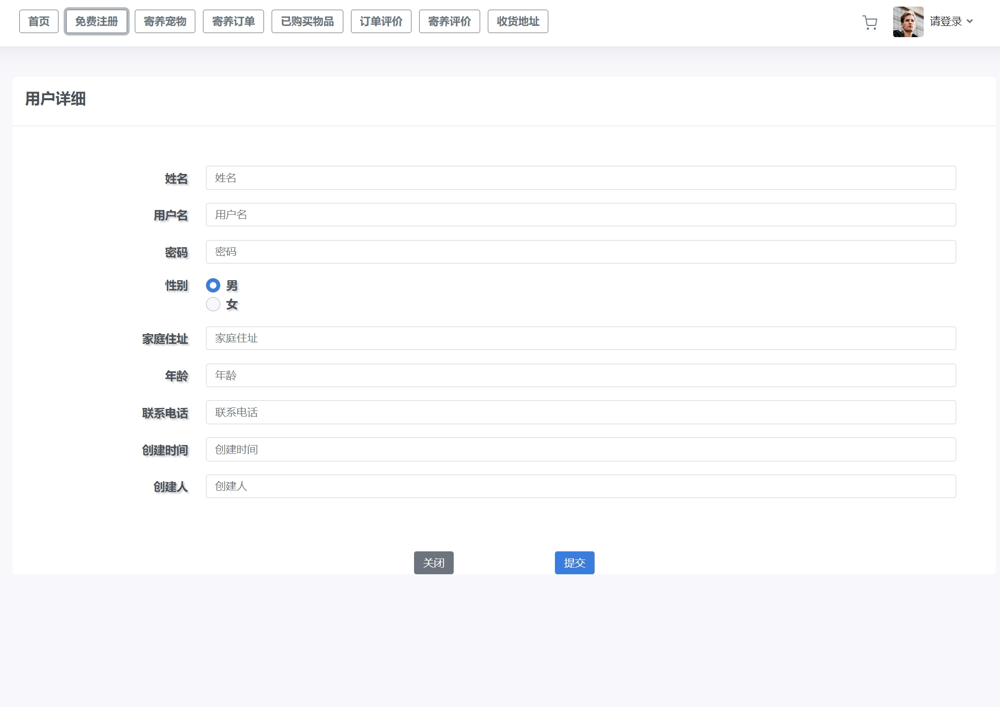
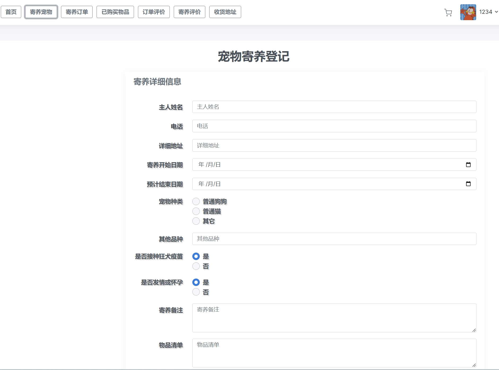
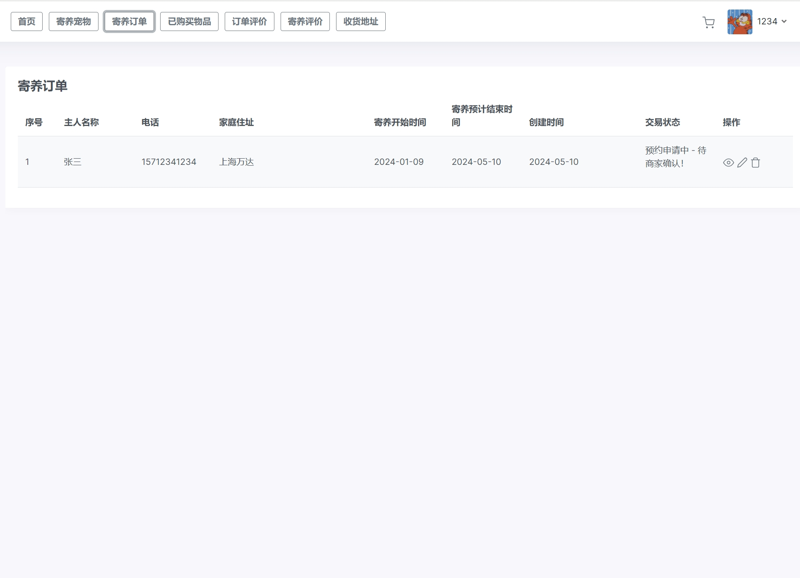

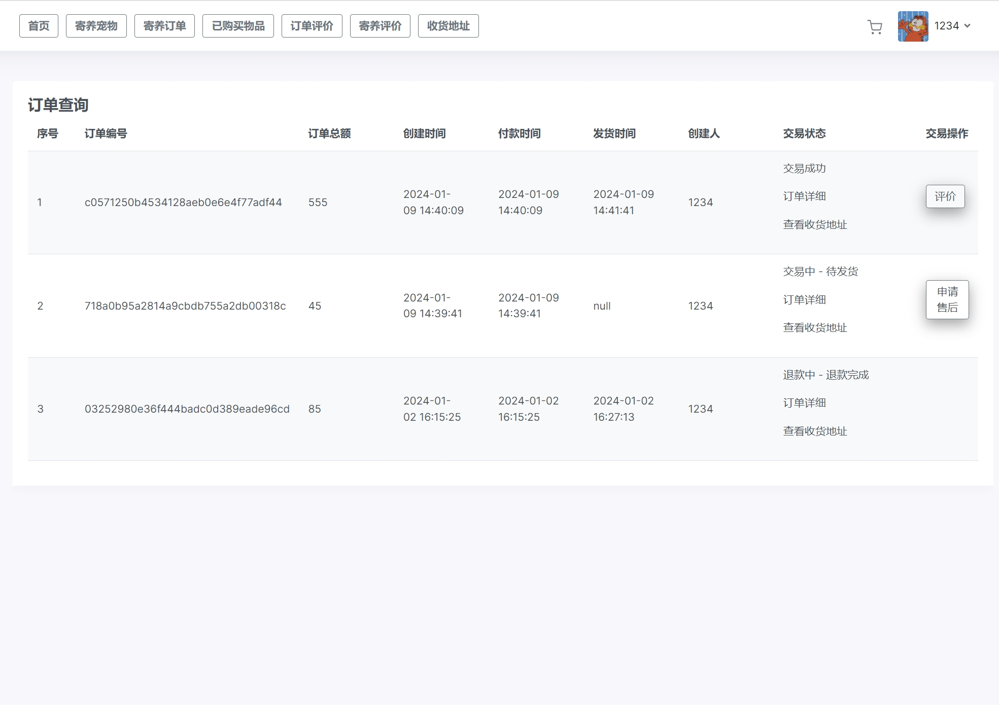

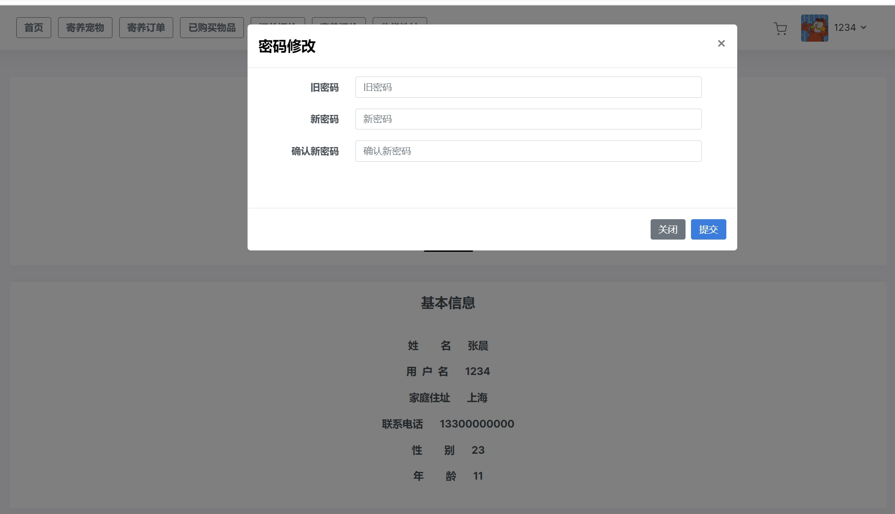

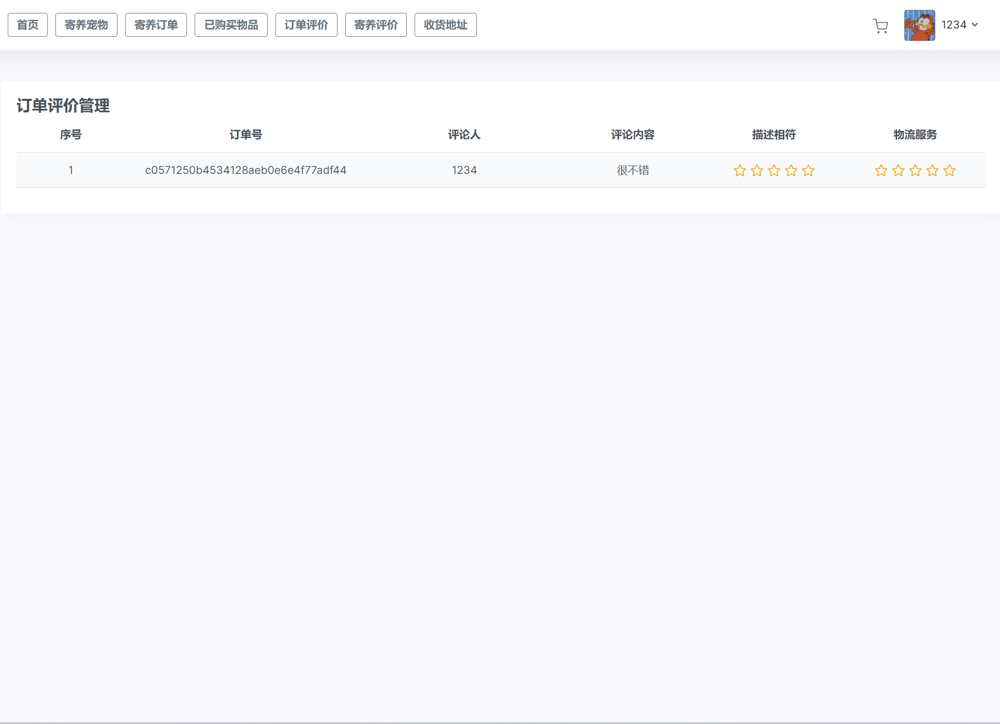
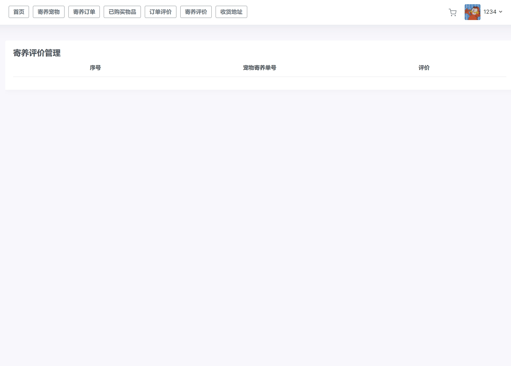
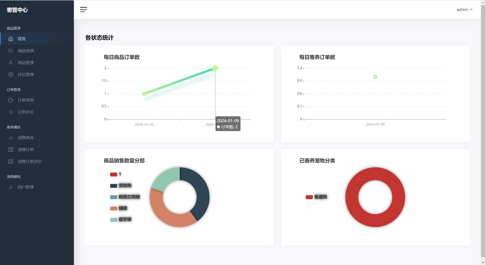

### 2、管理员
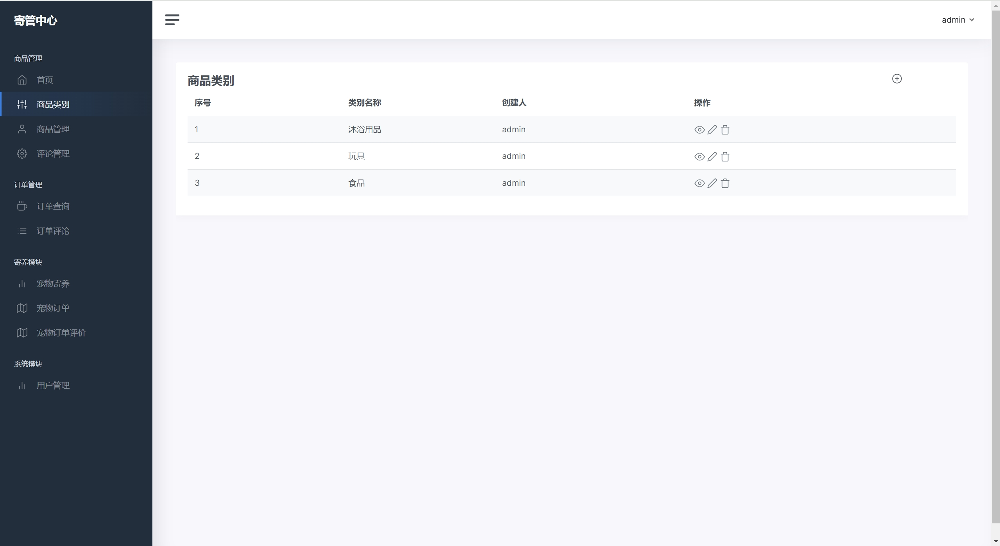

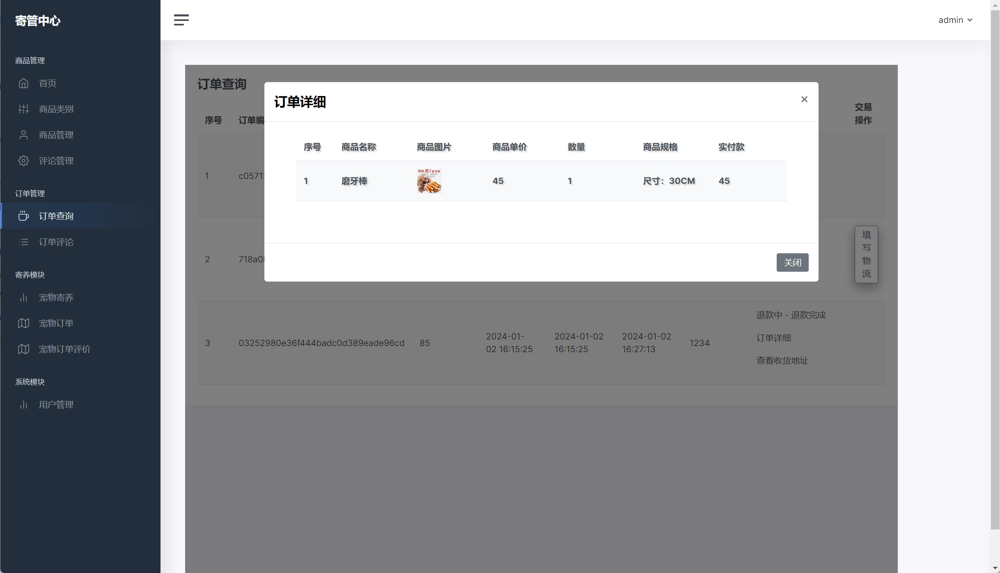
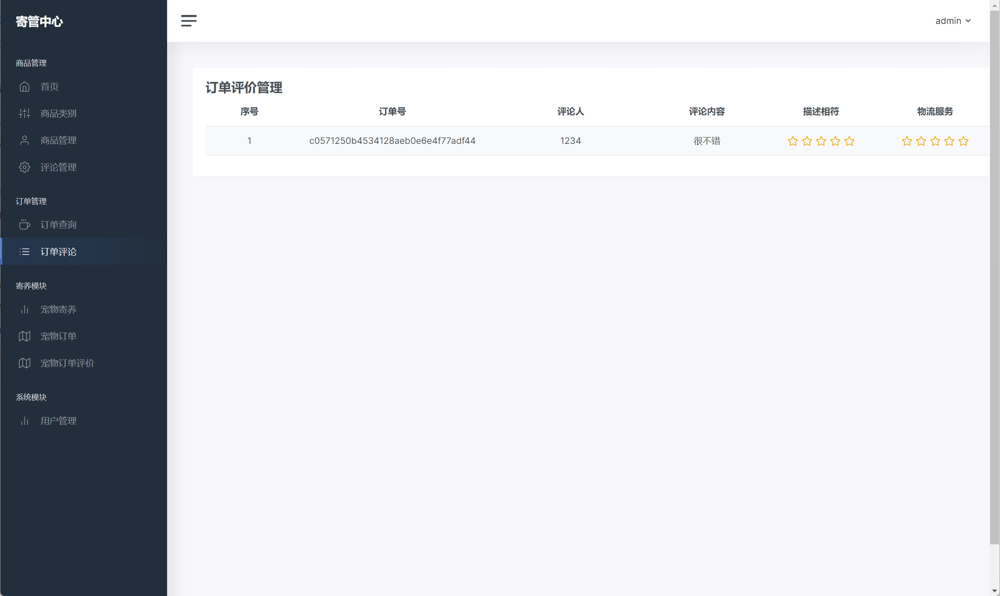

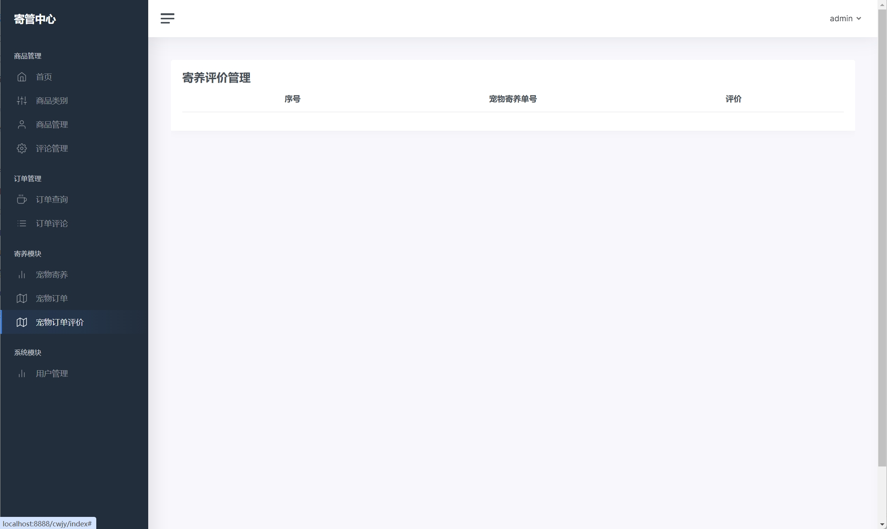

## 五、浏览地址

后端登录：http://localhost:8888/cwjy/login_admin  

账户密码：admin/admin

用户登录：http://localhost:8888/cwjy/login_user    

账户密码：1234/1234

## 六、部署教程
1. 使用Navicat或者其它工具，在mysql中创建对应名称的数据库，并执行项目的sql文件
2. 使用IDEA/Eclipse导入StaffManagerApi项目，若为maven项目请选择maven，等待依赖下载完成
3. 修改application.properties里面的数据库配置，启动后端项目
4. vscode或idea打开StaffManagerVue项目
5. 在编译器中打开terminal，执行npm install 依赖下载完成后执行 npm run dev,执行成功后会显示访问地址

